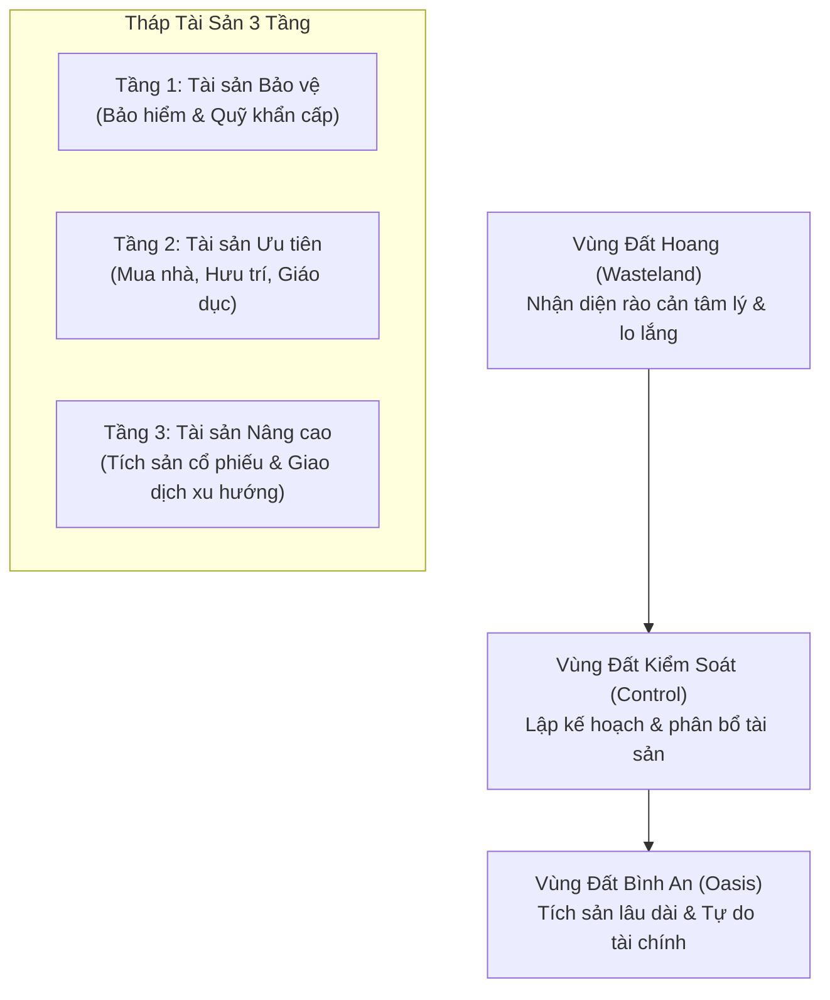

# 🏠 FinPeace Financial Knowledge Base

Chào mừng đến với **Kho Tri Thức Tài Chính FinPeace**. Đây là nơi hệ thống hóa toàn bộ triết lý tài chính cá nhân của FinPeace, lấy cuốn sách **Bình An Tài Chính 2025** làm khung sườn cốt lõi và tích hợp các tài liệu tham khảo chuyên sâu từ thư viện sách tài chính quốc tế.

---

## 🗺️ Bản Đồ Khám Phá Tri Thức

Kho tri thức được xây dựng dựa trên cấu trúc **Tháp Tài Sản 3 Tầng** và hành trình đi qua **3 Vùng Đất Tài Chính**:

---

## 📂 Danh Mục Tài Liệu Hệ Thống

### 🧠 1. Triết Lý Cốt Lõi (Core Philosophy)
*   [3 Vùng Đất Tài Chính](docs/core-philosophy/01-three-financial-lands.md): Nhận diện hành trình từ hoang mang lo lắng đến bình an đích thực.
*   [Nguyên Tắc Xây Tháp Tài Sản](docs/core-philosophy/02-asset-pyramid-rules.md): Lộ trình đi từ móng lên ngọn an toàn và vững chắc.
*   [Ứng Dụng DISC Trong Tài Chính](docs/core-philosophy/03-disc-financial-profiles.md): Thấu hiểu tính cách hành vi đầu tư của bản thân để làm đúng ngay từ đầu.

### 🛡️ 2. Tầng 1: Tài Sản Bảo Vệ (Layer 1 - Protection)
*   [Quản Trị Quỹ Khẩn Cấp](docs/layer-1-protection/emergency-fund-strategies.md): Thiết lập tấm khiên bảo vệ cuộc sống cơ bản trước giông bão.
*   [Hoạch Định Bảo Hiểm](docs/layer-1-protection/insurance-planning.md): Tóm tắt các chiến lược bảo hiểm nhân thọ và phi nhân thọ từ *Insurances Strategies* và *Place of Insurance*.

### 🏠 3. Tầng 2: Tài Sản Ưu Tiên (Layer 2 - Priority)
*   [Quy Trình Lập Kế Hoạch Tài Chính](docs/layer-2-priority/financial-planning-process.md): Thiết kế kế hoạch cuộc đời (nhà, xe, hưu trí) dựa trên tài liệu *Plan Process*.
*   [Giảm Thiểu Rủi Ro Phân Bổ](docs/layer-2-priority/asset-allocation-rules.md): Phương pháp phân bổ tài sản phòng vệ từ *Portfolio Risk Reduction*.

### 🚀 4. Tầng 3: Tài Sản Nâng Cao (Layer 3 - Advanced)
*   **Đầu Tư Giá Trị & Tích Sản (SIP)**:
    *   [Nguyên Tắc Đầu Tư Giá Trị](docs/layer-3-advanced/value-investing-sip/graham-buffett-principles.md): Tóm tắt tinh hoa từ *The Intelligent Investor* và *The Warren Buffett Way*.
    *   [Công Thức Kỳ Diệu (Magic Formula)](docs/layer-3-advanced/value-investing-sip/magic-formula-greenblatt.md): Ứng dụng công thức của Joel Greenblatt tại thị trường Việt Nam.
    *   [Phương Pháp Định Giá Cổ Phiếu](docs/layer-3-advanced/value-investing-sip/valuation-methods.md): Các công cụ định giá từ *Valuation of Stocks*.
*   **Giao Dịch Theo Xu Hướng (Trend Trading)**:
    *   [Khung Giao Dịch FinPeace Trend Analyzer](docs/layer-3-advanced/trend-trading/vietnam-trend-analyzer-framework.md): Hệ thống chấm điểm ma trận 2 chiều và quản trị hành vi đầu tư.
    *   [Hệ Thống CANSLIM](docs/layer-3-advanced/trend-trading/canslim-oneil-system.md): Chiến lược giao dịch tăng trưởng của William O'Neil (*How to Make Money in Stocks*).
    *   [Các Pha Chu Kỳ Wyckoff](docs/layer-3-advanced/trend-trading/wyckoff-market-phases.md): Nhận diện dòng tiền tích lũy và đẩy giá của Wyckoff.
    *   [Cẩm Nang Chỉ Báo Kỹ Thuật](docs/layer-3-advanced/trend-trading/technical-indicators-guide.md): Ứng dụng nến Nhật, RSI, Bollinger Bands và Elliott Wave (*Mastering Elliott Wave*).
*   **Quản Trị Vốn & Kỷ Luật Giao Dịch**:
    *   [Chiến Lược Quản Trị Vốn](docs/layer-3-advanced/risk-money-management/position-sizing-strategies.md): Quản trị rủi ro và quy mô vị thế theo Ralph Vince & Ryan Jones (*Money Management*).
    *   [Kiểm Soát Tâm Lý Giao Dịch](docs/layer-3-advanced/risk-money-management/emotion-free-trading-habits.md): Rèn luyện thói quen giao dịch không cảm xúc từ *Secrets of Emotion Free Trading*.

### 🌐 5. Tài Sản Số & Blockchain (Digital Assets & Blockchain)
*   [Tổng Quan Kiến Trúc Blockchain](docs/blockchain/overview.md): Cấu trúc khối, cơ chế đồng thuận (PoW, PoS, DPoS, PBFT) và mô hình sổ cái (UTXO vs Account).
*   [Bản Đồ Công Cụ Lập Trình](docs/blockchain/developer-tools.md): Tổng hợp IDE, SDK, và thư viện phát triển blockchain theo ngôn ngữ (JS, Go, Python, Rust, C++).
*   [Hợp Đồng Thông Minh & DeFi](docs/blockchain/smart-contracts-defi.md): Tiêu chuẩn token (ERC-20, ERC-721), quy tắc bảo mật và ứng dụng RWA trong tích sản tài chính.
*   [Series Học Tập Ứng Dụng Crypto](docs/blockchain/crypto-applications-series.md): Lộ trình học tập phân loại ứng dụng từ Giá trị thấp (Đầu cơ) đến Giá trị cao (Utility, RWA, DePIN).

---

## 🛠️ Bộ Công Cụ & Quản Trị
*   Hướng dẫn chạy các công cụ tự động hóa định giá & phân tích vĩ mô nằm tại thư mục [tools/](tools/).
*   [Tích hợp Cloudflare LLM (Kimi miễn phí)](docs/ai-infrastructure-cloudflare.md): Hướng dẫn kết nối và code mẫu kết nối AI miễn phí.
*   [Hướng dẫn Đẩy Kho Tri Thức lên GitHub](docs/github-guide.md): Quy trình khởi tạo Git và quản trị kho tri thức.
