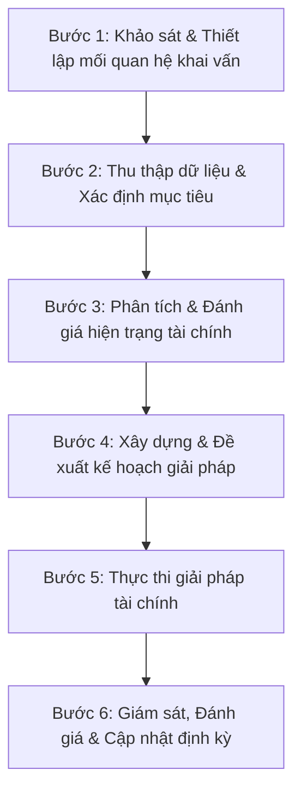

# 📋 Quy Trình Lập Kế Hoạch Tài Chính Cá Nhân (Financial Planning Process)

Quy trình lập kế hoạch tài chính cá nhân ở **Tầng 2 (Tài sản Ưu tiên)** cung cấp một phương pháp luận có hệ thống giúp chuyển dịch các ước mơ cuộc đời thành các mục tiêu tài chính đo lường được.

---

## 1. Quy Trình Lập Kế Hoạch Tiêu Chuẩn

Dựa trên tài liệu chuyên sâu **Plan Process**, quy trình hoạch định tài chính cá nhân được triển khai qua 6 bước khoa học:

---

## 2. Chi Tiết Các Bước Triển Khai

### 🔹 Bước 1: Khảo sát & Thiết lập mối quan hệ
*   Thống nhất phạm vi công việc giữa Wealth Coach (Nhà hoạch định) và Khách hàng.
*   Thiết lập sự tin cậy và hiểu rõ kỳ vọng ban đầu của khách hàng.

### 🔹 Bước 2: Thu thập dữ liệu & Xác định mục tiêu
*   **Dữ liệu định lượng**: Thu nhập, chi tiêu, nợ nần, tài sản hiện có.
*   **Dữ liệu định tính**: Mức độ chấp nhận rủi ro, giá trị cốt lõi cuộc sống, nỗi sợ hãi tài chính.
*   **Xác định mục tiêu**: Phân loại mục tiêu theo 3 tầng tháp tài sản (Bảo vệ - Ưu tiên - Nâng cao) kèm theo dòng tiền và mốc thời gian cụ thể (ví dụ: mua nhà 5 tỷ trong 5 năm).

### 🔹 Bước 3: Phân tích & Đánh giá hiện trạng
*   Sử dụng bảng cân đối kế toán cá nhân (Personal Balance Sheet) và báo cáo lưu chuyển tiền tệ (Cash Flow Statement).
*   Đánh giá các chỉ số sức khỏe tài chính: Tỷ lệ nợ trên tài sản, tỷ lệ tiết kiệm trên thu nhập, tính khả thi của mục tiêu (so sánh lợi suất yêu cầu vs. thực tế vĩ mô).

### 🔹 Bước 4: Xây dựng & Đề xuất kế hoạch
*   Thiết kế các phương án giải quyết bài toán mục tiêu.
    *   *Ví dụ*: Bài toán mua nhà của chị Ngọc trong sách được phân tích qua 3 phương án: kéo dài thời gian thực hiện, nâng cao hiệu suất đầu tư bằng tích sản (SIP), hoặc gia tăng dòng tiền tiết kiệm hàng tháng.
*   Đề xuất danh mục phân bổ tài sản phù hợp với tính cách DISC của khách hàng.

### 🔹 Bước 5: Thực thi giải pháp
*   Hỗ trợ khách hàng đưa kế hoạch vào hành động thực tế.
    *   **Quan trọng đối với nhóm S**: Thúc đẩy họ hành động ngay lập tức như mở tài khoản chứng khoán tích sản, cài đặt trích tiền tự động.
    *   **Quan trọng đối với nhóm I**: Tự động hóa tối đa quy trình để tránh cảm xúc chi phối.

### 🔹 Bước 6: Giám sát & Cập nhật định kỳ
*   Thị trường vĩ mô và cuộc sống của khách hàng luôn thay đổi. Do đó, kế hoạch cần được xem xét và cập nhật định kỳ (hàng quý hoặc hàng năm) để điều chỉnh tỷ trọng phân bổ tài sản cho phù hợp với hoàn cảnh mới.
