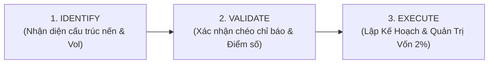

# 📈 Khung Giao Dịch & Phân Tích Cấu Trúc Xu Hướng FinPeace

Tài liệu này chi tiết hóa **Khung phân tích xu hướng FinPeace (Vietnam Trend Analyzer)** - hệ thống giao dịch lượng hóa cấu trúc sóng, kết hợp các chiến lược động lượng (Trend) và dao động (Sideway) để xây dựng kế hoạch giao dịch (Trading Plan) thực tế, đồng thời theo dõi tính kỷ luật của nhà đầu tư.

---

## 1. Quy Trình 3 Bước: Identify $\rightarrow$ Validate $\rightarrow$ Execute

Hệ thống Trend Analyzer vận hành theo quy trình tuần tự chặt chẽ:

1.  **Identify (Nhận diện)**: Đánh giá hành động giá (Price Action) và khối lượng giao dịch (Volume) để xác định cấu trúc thị trường đang ở pha nào của chu kỳ Wyckoff (Tích lũy, Đẩy giá, Phân phối, Đè giá).
2.  **Validate (Xác nhận)**: Chạy hệ thống chấm điểm Ma trận tọa độ 2 chiều (Trend vs. Sideway) và bộ lọc vĩ mô để loại bỏ tín hiệu nhiễu.
3.  **Execute (Thực thi)**: Soạn thảo Trading Plan với đầy đủ các mức giá **ENTRY, STOP LOSS, TAKE PROFIT** và quy mô vị thế theo quy tắc quản trị vốn 2%.

---

## 2. Hệ Thống Chấm Điểm Ma Trận Tọa Độ 2 Chiều

Để lượng hóa trạng thái của cổ phiếu, hệ thống chấm điểm độc lập trên 2 thang đo (tối đa 5 điểm mỗi thang). Mỗi trục gồm 5 chiến lược cụ thể; nếu chiến lược cho tín hiệu **BUY/HOLD** thì được cộng **1 điểm**.

### Trục 1: Động Lượng Xu Hướng (Trend Score - Thang điểm 0/5)
1.  **SMA Cross**: Điểm số vàng (Golden Cross) hoặc giá nằm trên cụm SMA30/SMA60 (*John J Murphy - Charting Made Easy*).
2.  **MACD Line**: MACD cắt lên Signal Line và Histogram dương.
3.  **SuperTrend**: Cấu trúc giá tôn trọng đường viền mây hỗ trợ bên dưới.
4.  **Parabolic SAR**: Các chấm SAR nằm dưới thân nến đỡ giá.
5.  **Momentum (Gia tốc)**: Gia tốc giá đang tăng dần (độ dốc nến tăng).

### Trục 2: Dao Động & Độ Nén (Sideway Score - Thang điểm 0/5)
1.  **RSI Strategy**: RSI nằm trong khoảng an toàn $50 < \text{RSI} < 70$ (chưa quá mua, còn dư địa tăng - *John Hayden - How to Use the RSI*).
2.  **Bollinger Bands**: Giá bật lên từ dải dưới (Lower Band) hoặc rải nến kẹp sát vào đường trung bình Mid-band.
3.  **Stochastic Slow**: Đường %K cắt lên %D từ vùng quá bán (<20).
4.  **Channel BreakOut (Hộp Darvas)**: Giá tích lũy biên độ hẹp với Volume cạn kiệt ở cạnh dưới chiếc hộp tích lũy (*Joe Ross - How to Spot a Trend*).
5.  **Consecutive Up/Down**: Xuất hiện chuỗi nến chối từ giảm (Rejection) hoặc rút chân mạnh ở vùng hỗ trợ.

---

## 3. Lưới Đánh Giá Ma Trận Tọa Độ (Scoring Matrix)

Dựa trên điểm số tích lũy của hai trục, hệ thống đưa ra khuyến nghị hành động tự động:

| Trend Score | Sideway Score | Trạng Thái Tọa Độ | Khuyến Nghị Hành Động (Call-to-Action) |
| :---: | :---: | :--- | :--- |
| **4 - 5** | **0 - 2** | **Breakout Tăng / Siêu Vuốt Xu Hướng** | **PASS**: Buy hoặc Hold quyết liệt khi bứt phá nền. |
| **4 - 5** | **3 - 5** | **Quá Mua / Rủi ro Chốt Lời** | **TAKE PROFIT / HOLD**: Giữ vị thế, tuyệt đối cấm mua đuổi margin. |
| **0 - 1** | **4 - 5** | **Vùng Tích Lũy Tuyệt Đối / Nén Đáy** | **PASS**: Mua thăm dò trước 30% NAV tại nền giá tốt. |
| **0 - 1** | **0 - 1** | **Rơi Tự Do / Vùng Bán Khống** | **SKIP**: Tuyệt đối không bắt dao rơi, cắt lỗ bảo toàn vốn. |
| **2 - 3** | **2 - 3** | **Tranh Chấp Hỗn Loạn (Messy)** | **HOLD / WATCH**: Đứng ngoài quan sát, chờ tín hiệu rõ ràng. |

---

## 4. Quản Trị Hành Vi Nhà Đầu Tư (AutoPilot Phase 2)

Sau khi Trading Plan được phê duyệt và giải ngân, hệ thống so sánh các lệnh thực tế của nhà đầu tư (qua báo cáo giao dịch của công ty chứng khoán) với kế hoạch ban đầu để phát hiện 4 lỗi lệch chuẩn tâm lý:

*   **FOMO Buy**: Mua đuổi giá cao ngoài vùng giá Entry Zone quy định.
*   **Revenge Trading (Giao dịch trả thù)**: Tiếp tục trung bình giá xuống hoặc mua lại ngay sau khi vị thế vừa chạm ngưỡng STOP LOSS.
*   **Chốt lời sớm (Early Profit-Taking)**: Đóng vị thế chốt lời non khi giá chưa đạt 60% mục tiêu TAKE PROFIT đã định.
*   **Hold quá hạn (Discipline Fail)**: Giữ cổ phiếu vượt quá số ngày nắm giữ dự kiến (`expected_holding_days`) khi xu hướng đã đảo chiều mà không thực hiện cắt lỗ.

### Chỉ Số Tuân Thủ Kế Hoạch (Plan Adherence Score - PAS)
Chỉ số PAS được tính trên thang điểm từ **0 - 100**. Nhà đầu tư có điểm PAS < 60 sẽ bị tạm dừng giải ngân các Plan mới và bắt buộc phải qua quy trình tái khai vấn hành vi (Behavioral Coaching) dựa trên các nguyên tắc của *Secrets of Emotion Free Trading* (Larry Lewin) và *7 Habits of a Highly Successful Trader* (Mark Crisp) để lập lại kỷ luật.
